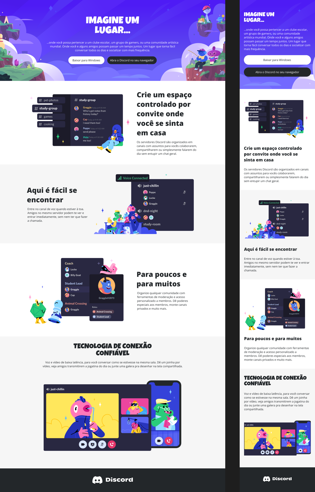

# Discord Page

## Contexto

O projeto consiste em uma reprodução da página da plataforma de comunicação Discord com o intuito de praticar responsividade no CSS.

## Stack utilizada

**Front-end:**
HTML, CSS.

## Deploy
[Ver deploy](https://omarcosdanilo.github.io/discord_page/)

## Screenshots

